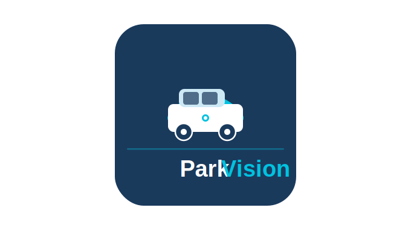

# ParkVision — Guia para Claude Code



Sistema Flask + MySQL de gestão de estacionamento condominial com câmeras LPR (Heimdall).
Consulte `PADROES_PROJETO.md` para convenções detalhadas.

**Domínio de produção:** https://parkvision.tech

## Infraestrutura de Produção (VPS)

| Item | Valor |
|------|-------|
| **VPS** | Hostinger — `srv980686.hstgr.cloud` |
| **IP** | `72.60.58.241` |
| **OS** | Ubuntu (systemd) |
| **App dir** | `/home/workuser/parkvision` |
| **Venv** | `/home/workuser/parkvision/venv` |
| **Serviço** | `flaskapp.service` (systemd, usuário `workuser`) |
| **Porta interna** | `127.0.0.1:8000` (Gunicorn) |
| **Nginx config** | `/etc/nginx/sites-available/parkvision` |
| **SSL** | Let's Encrypt via Certbot — renova automaticamente |
| **Cert expira** | 2026-09-25 |

**Comandos úteis no VPS:**
```bash
systemctl status flaskapp          # status da aplicação
systemctl restart flaskapp         # reiniciar após deploy
journalctl -u flaskapp -f          # logs em tempo real
systemctl reload nginx             # recarregar Nginx sem derrubar
certbot renew --dry-run            # testar renovação do certificado
```

## Stack

- **Backend:** Python 3.13 + Flask 2.x + MySQL (sem ORM — SQL direto)
- **Frontend:** Jinja2 + Bootstrap 5 + jQuery (via CDN)
- **Servidor:** Gunicorn + Nginx em produção
- **Timezone:** America/Sao_Paulo

## Estrutura de Arquivos

```
main.py               # Todas as rotas Flask (único arquivo — não usar Blueprints)
globals.py            # Funções legadas de autenticação (manter compatibilidade)
logging_config.py     # Logging centralizado
config/database.py    # get_db_connection() — conexão MySQL

visionlib/
  middleware.py       # @requer_autenticacao, @requer_tipo_usuario, @requer_acesso_condominio, @api_requer_admin
  authlib/            # Login bcrypt, sessões, recuperação de senha
  userlib/            # CRUD usuários, solicitações de inscrição
  dblib/              # NÚCLEO: gravar_movimento() + queries auxiliares
  vplib/              # Validação e correção de placas (fuzzy matching, OCR)
  operlib/            # Store de eventos em memória + ações do operador
  permlib/            # Permissões de estacionamento (cadperm)
  carlib/             # CRUD cadveiculo, não-cadastrados, apelidos
  listlib/            # Listagens (usa vw_movimentos)
  dashlib/            # Mapa de vagas (usa vw_estacionados)
  rellib/             # Relatórios
  camlib/             # Daemon RTSP health-check de câmeras
  loglib/             # Persistência assíncrona de logs (tabela logsistema) + limpeza automática (retenção 3 dias)
  condlib/            # Dados de condomínios
  apontlib/           # Apontamento manual (bypass câmera)
  unidlib/            # Gestão de unidades habitacionais
  teleglib/           # Notificações Telegram
  apilib/             # Receptor webhook Heimdall (wrapper sobre gravar_movimento)
  mobilelib/          # Queries para a versão mobile (movimentos, estacionados, mapa, permissões, novo veículo)

templates/
  mobile/             # Templates da versão mobile PWA (login, condominio, monitoramento)
static/               # CSS, imagens
  icons/              # Ícones PWA (apple-touch-icon, favicon, icon-192, icon-512)
  manifest.json       # Web App Manifest (PWA)
  sw.js               # Service Worker (PWA — cache offline básico)
ArquivosApoio/        # Scripts utilitários (não entram em produção)
doc_suporte/BaseDeDados/
  base_parkvision.txt # Schema MySQL completo
  views.txt           # Definições SQL das views
```

## Regras Críticas

### Multi-tenant
Todo dado deve ser filtrado por `idcond`. Nunca misturar dados de condomínios diferentes.

### Banco de dados
- SQL direto — sem ORM
- `get_db_connection()` abre e fecha por função (não reaproveitar conexões entre chamadas)
- Sempre `cursor.close()` + `conn.close()` no `finally`
- `cursor(dictionary=True)` para facilitar manipulação
- Prepared statements obrigatórios: `cursor.execute("... WHERE id = %s", (valor,))`

```python
def funcao_exemplo(idcond):
    conn = get_db_connection()
    if not conn:
        return False, "Erro de conexão"
    cursor = conn.cursor(dictionary=True)
    try:
        cursor.execute("SELECT * FROM tabela WHERE idcond = %s", (idcond,))
        resultado = cursor.fetchall()
        conn.commit()  # se houver escrita
        return True, resultado
    except Exception as err:
        conn.rollback()
        return False, str(err)
    finally:
        cursor.close()
        conn.close()
```

### Resposta JSON (obrigatório em todas as APIs)
```python
return jsonify({'success': True, 'message': 'OK', 'data': dados})
return jsonify({'success': False, 'message': 'Mensagem de erro'})
```

### Autenticação
- Usar decorators de `visionlib/middleware.py` nas rotas novas
- `session['usuario']` contém: `idgente`, `nome_curto`, `tipo_usuario`, `condominios`
- Tipos: `ADM` (total), `MONITOR`, `SINDICO`
- Em código legado: `globals.verificar_autenticacao()` / `globals.verificar_acesso_condominio(idcond)`

### Logging
```python
import logging
logger = logging.getLogger(__name__)
logger.info("mensagem")
logger.error(f"erro: {err}")
```

Logs de `app.logger` e do logger raiz `visionlib` são gravados tanto no arquivo (`parkvision.log`, rotativo) quanto na tabela `logsistema` (retenção de 3 dias, via `loglib`). A gravação no banco é assíncrona (fila em memória + thread), então `logger.info()`/`logger.error()` nunca bloqueiam esperando o MySQL.

> Exceção à regra "não usar `print()`": dentro de `visionlib/loglib/` os erros do próprio pipeline de log usam `print()` propositalmente, para evitar recursão infinita (um `logger.error()` ali reentraria no handler que está falhando).

## Banco de Dados — Tabelas e Convenções

Nomenclatura legacy compacta (não mudar):

| Tabela | Descrição |
|--------|-----------|
| `cadcond` | Condomínios (`idcond`, `nmcond`) |
| `cadcamera` | Câmeras (`idcam`, `idcond`, `direcao` E/S/I) |
| `cadveiculo` | Veículos (`placa` PK, sem unidade/condomínio) |
| `cadperm` | Permissões (`idperm`, `placa`, `idcond`, `unidade`, `data_inicio`, `data_fim` NULL=indefinida) |
| `movcar` | Movimentos (`idmov`, `idcond`, `placa`, `contav`, `idgente`, `direcao`, `nowpost`, `origem`) |
| `vagasunidades` | Vagas por unidade (`idcond`, `unidade`, `vperm`, `seqcond`) |
| `logbruto` | JSON bruto do Heimdall |
| `logsistema` | Logs do sistema (`idlog`, `nivel`, `mensagem`, `criado_em`) — gravação assíncrona via `loglib`, retenção de 3 dias (limpeza automática a cada hora) |
| `usuarios` | Usuários (`idgente`, `tipo_usuario`, `ativo`) |

**Views principais:** `vw_autorizacoes`, `vw_estacionados`, `vw_movimentos`, `vw_last_mov`, `vw_veiculos_cond`, `vw_veiculos_autorizados`

**Semântica de `contav` em `movcar`:**
- `contav=0` + `idgente IS NULL` → evento pendente (aguardando operador)
- `contav=0` + `idgente IS NOT NULL` → rejeitado pelo operador
- `contav=1` → confirmado, conta vaga

**Unidades especiais:** 'Prestador', 'Avulso', 'Visitante' → recebem 10 vagas fixas (não consultam `vagasunidades`)

**Campo `origem` em `movcar`:** identifica a fonte do movimento — `'LPR'` (câmera Heimdall), `'MANUAL'` (apontamento manual), `NULL` → tratado como `'MANUAL'` via `COALESCE`.

## Versão Mobile (PWA)

Rotas sob o prefixo `/app/` servem a interface mobile — uma PWA instalável via `static/manifest.json` + `static/sw.js`.

### Rotas de página

| Rota | Descrição |
|------|-----------|
| `/app/` | Redirect para login ou monitoramento |
| `/app/login` | Login mobile |
| `/app/condominio` | Seleção de condomínio |
| `/app/selecionar/<idcond>` | Salva condomínio em `session['mobile_idcond']` |
| `/app/monitoramento` | SPA principal com menu inferior |
| `/app/logout` | Logout |

### APIs mobile (`/api/m/`)

Todas exigem autenticação via `verificar_autenticacao_usuario()` e leem `idcond` de `session['mobile_idcond']`.

| Rota | Método | Lib usada | Descrição |
|------|--------|-----------|-----------|
| `/api/m/movimentos` | GET | `mobilelib` | Últimos 20 movimentos (polling 30s) |
| `/api/m/mapa-vagas` | GET | `dashlib` | Mapa de vagas (unidades + ocupação) |
| `/api/m/estacionados` | GET | `mobilelib` | Veículos atualmente estacionados |
| `/api/m/unidade-veiculos/<unidade>` | GET | `mobilelib` | Veículos em uma unidade (detalhe do mapa) |
| `/api/m/unidades` | GET | `permlib` | Lista de unidades do condomínio |
| `/api/m/buscar-veiculo/<placa>` | GET | `carlib` | Busca veículo em `cadveiculo` |
| `/api/m/buscar-permissao/<placa>` | GET | `mobilelib` | Busca permissão vigente/indefinida |
| `/api/m/criar-permissao` | POST | `permlib` | Cria nova permissão (veículo já cadastrado) |
| `/api/m/modificar-permissao` | PUT | `permlib` | Altera prazo de permissão vigente |
| `/api/m/novo-veiculo` | POST | `mobilelib` | Cria veículo + permissão em uma operação |

> Para marcas/modelos/cores, o frontend mobile usa as APIs públicas já existentes: `/api/marcas`, `/api/modelos/<marca>`, `/api/cores`.

### Funcionalidades da SPA (`/app/monitoramento`)

Menu inferior com 4 abas:
- **Início** — monitoramento em tempo real (polling 30 s)
- **Mapa** — grid de unidades com código de cores (Excesso=vermelho, Completo=azul, Parcial=amarelo, Livre=branco); toque na unidade abre veículos estacionados
- **Estacionados** — lista de veículos com placa, unidade, veículo, hora de entrada
- **Mais (⋮)** — abre 4 formulários deslizantes: Novo Veículo, Criar Permissão, Alterar Permissão, Consulta

### Funções do `mobilelib`

| Função | Descrição |
|--------|-----------|
| `obter_ultimos_movimentos_mobile(idcond, limit)` | Usa `vw_movimentos` |
| `obter_estacionados_mobile(idcond)` | Usa `vw_autorizacoes` + `vw_last_mov` |
| `obter_veiculos_unidade_mobile(idcond, unidade)` | Igual ao anterior, filtrado por unidade |
| `buscar_permissao_mobile(idcond, placa)` | Usa `vw_veiculos_autorizados` |
| `novo_veiculo_mobile(idcond, placa, ...)` | Cria em `cadveiculo` + `cadperm` atomicamente |

### Sessão e autenticação mobile

- Usa a **mesma sessão web** (`session['usuario']`, `session['autenticado']`)
- `session['mobile_idcond']` armazena o condomínio selecionado na versão mobile
- O `verificar_acesso_condominio()` do `globals.py` funciona normalmente (lê `session['usuario']`)
- Ícones PWA ficam em `static/icons/`; Apple exige `apple-touch-icon.png` na raiz (rota dedicada em `main.py`)

## Bug Conhecido — Veículo com 2 Permissões Ativas

Se uma placa tem `cadperm` em duas unidades do mesmo condomínio, a `vw_movimentos` retorna o movimento duplicado (2 linhas por `idmov`). Causa raiz: `vw_veiculos_cond` retorna 2 linhas → JOIN multiplica. Ao implementar relatórios ou listagens, deduplique por `idmov` após fetchall.

## Fluxo LPR (informação para contexto)

```
POST /api/receber-dados → apilib → dblib.gravar_movimento()
  ├─ vplib.process_heimdall_plate()  # valida/corrige placa
  ├─ checar_anteriores()             # anti-duplicata (90s)
  ├─ gravar_log() → INSERT movcar (contav=0, sem operador)
  └─ operlib.adicionar_evento()      # push para polling do front
```

## Convenções de Nomenclatura

- **Python:** `snake_case` funções e variáveis, `UPPER_SNAKE_CASE` constantes
- **Templates HTML:** `kebab-case` (ex: `mapa-vagas.html`)
- **Banco:** abreviações compactas em português (`idgente`, `nmcond`, `nowpost`, `lup`)
- **Views SQL:** prefixo `vw_`
- **CSS/IDs HTML:** `kebab-case`
- **JavaScript:** `camelCase`

## Env Vars Relevantes

`SECRET_KEY`, `DB_HOST`, `DB_USER`, `DB_PASSWORD`, `DB_NAME`, `CAMERAS_ENABLED`, `CAM_MONITOR_INTERVAL_MIN`, `SESSION_COOKIE_SECURE`

## Reuso de Queries — Verificar Antes de Escrever SQL

Antes de escrever qualquer query nova, verificar nesta ordem:

1. **Views SQL** — as views já encapsulam os JOINs mais comuns. Preferir sempre uma view a reescrever os mesmos JOINs à mão:
   - `vw_movimentos` → movimentos confirmados com unidade, marca, modelo, cor, status de vaga
   - `vw_autorizacoes` → permissões com dados do veículo e status (VIGENTE/VENCIDA/INDEFINIDA)
   - `vw_estacionados` → contagem de veículos estacionados por unidade
   - `vw_last_mov` → último movimento confirmado por veículo
   - `vw_veiculos_cond` → permissão ativa de cada veículo por condomínio
   - `vw_veiculos_autorizados` → veículos com permissão vigente no momento

2. **Funções das libs** — verificar se a lib responsável pelo domínio já expõe a query necessária:
   - `listlib` → listagens de movimentos e detalhes de veículo/unidade
   - `dashlib` → mapa de vagas
   - `condlib` → dados de condomínios
   - `carlib` → CRUD de veículos, não-cadastrados, apelidos
   - `permlib` → permissões (`cadperm`)
   - `mobilelib` → todas as queries da versão mobile (movimentos, estacionados, veículos por unidade, busca de permissão, criação de veículo+permissão)

3. **Só então** escrever SQL novo — e colocá-lo na lib do domínio correto, nunca direto em `main.py`.

> Exemplo do que não fazer: reescrever os JOINs `cadveiculo → cadmodelo → cadmarca → cadcores` manualmente quando `vw_movimentos` ou `vw_autorizacoes` já os entregam prontos.

## O que Não Fazer

- Não usar ORM (SQLAlchemy, etc.)
- Não criar arquivos de rota separados nem Blueprints (toda rota vai em `main.py`)
- Não reaproveitar conexão MySQL entre funções diferentes
- Não filtrar dados sem `idcond`
- Não retornar JSON sem o campo `success`
- Não usar `print()` para debug — usar `logger`
- Não modificar views SQL sem atualizar `doc_suporte/BaseDeDados/views.txt`
- Não reescrever JOINs que já existem em views — consultar a seção "Reuso de Queries" acima
