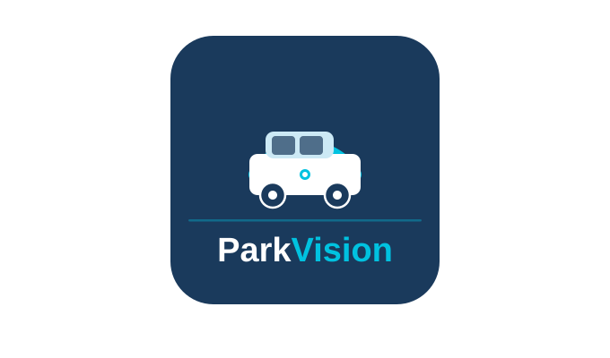

# ParkVision — Guia para Claude Code



Sistema Flask + MySQL de gestão de estacionamento condominial com câmeras LPR (Heimdall).
Consulte `PADROES_PROJETO.md` para convenções detalhadas.

**Domínio de produção:** https://parkvision.tech

## Infraestrutura de Produção (VPS)

| Item | Valor |
|------|-------|
| **VPS** | Hostinger — `srv980686.hstgr.cloud` |
| **IP** | `72.60.58.241` |
| **OS** | Ubuntu (systemd) |
| **App dir** | `/home/workuser/parkvision` |
| **Venv** | `/home/workuser/parkvision/venv` |
| **Serviço** | `flaskapp.service` (systemd, usuário `workuser`) |
| **Porta interna** | `127.0.0.1:8000` (Gunicorn) |
| **Nginx config** | `/etc/nginx/sites-available/parkvision` |
| **SSL** | Let's Encrypt via Certbot — renova automaticamente |
| **Cert expira** | 2026-09-25 |

**Comandos úteis no VPS:**
```bash
systemctl status flaskapp          # status da aplicação
systemctl restart flaskapp         # reiniciar após deploy
journalctl -u flaskapp -f          # logs em tempo real
systemctl reload nginx             # recarregar Nginx sem derrubar
certbot renew --dry-run            # testar renovação do certificado
```

**Deploy é manual, não automático.** `git commit`/`git push` não afetam a VPS nem o banco de produção — não há CI/CD nem webhook configurado. Só entra no ar quando alguém faz SSH na VPS e roda (ver `ArquivosApoio/deploy_parkvision_tech.txt`):
```bash
cd /home/workuser/parkvision
git pull
systemctl restart flaskapp
```
A VPS tem seu próprio `.env` (`/home/workuser/parkvision/.env`), independente do `.env` local — mudanças de configuração local (ex: apontar para banco de teste) não se propagam para lá.

**Propriedade dos arquivos em `/home/workuser/parkvision`:** deve ser `workuser:workuser` (é o usuário que roda `flaskapp.service`). Se o deploy for feito via SSH como `root` (ex: chave/alias sem usuário `workuser` disponível), `git pull` deixa os arquivos atualizados como `root:root` — o app ainda funciona (permissões `644`/`755` dão leitura a todos), mas o processo `workuser` perde permissão de escrita no diretório, o que quebra silenciosamente a rotação de log (`RotatingFileHandler` em `logging_config.py` precisa renomear/remover arquivos em `parkvision.log.*`, e isso exige permissão de escrita no diretório, não só no arquivo). Foi o que aconteceu entre 2026-04-04 (data em que `parkvision.log.2`/`.3` pararam de ser atualizados) e 2026-09-13 (quando corrigido). Se depois de um deploy aparecer `PermissionError` em `journalctl -u flaskapp` apontando para `parkvision.log.*`, rodar como root: `chown -R workuser:workuser /home/workuser/parkvision`.

**Estado atual (2026-08-17):** a VPS está rodando a branch `feature/matching-placas-aprendido` (não `main`) — deploy feito assim de propósito para validar o modo sombra da Fase 5 do matching aprendido de placas (ver seção própria) em produção antes de abrir mão do PR aberto. Ao fazer deploy dali em diante, checar `git branch --show-current` na VPS antes de assumir que é `main`.

## Desenvolvimento Local

**Nunca rodar a aplicação local nem testes apontando para o banco de produção.** O app local (`127.0.0.1:5000`) e a instância da VPS são processos independentes, mas se o `.env` local apontar para `DB_HOST=72.60.58.241`, qualquer escrita feita localmente grava direto em dados reais — e algumas ações (ex: `enviar_pulso_por_direcao` em `visionlib/operlib/__init__.py`) fazem uma chamada HTTP real para o relé físico do portão (`caddisp.urldisp`), ou seja, um teste de "abrir porta" local pode acionar o portão de verdade em um condomínio real.

Use um MySQL local para desenvolvimento e testes:
- Serviço MySQL local (Windows: `MySQL80`, porta `3306`)
- Banco `parkvision_test`, schema idêntico ao de produção (importado de `doc_suporte/BaseDeDados/base_parkvision.txt` + `views.txt`)
- A tabela `logsistema` não faz parte do dump — é criada automaticamente pelo `loglib` (`CREATE TABLE IF NOT EXISTS`) na primeira execução do app; isso é esperado, não é um gap de schema
- `.env.example` já reflete essa configuração (`DB_HOST=localhost`, `DB_NAME=parkvision_test`) — copiar para `.env` e preencher a senha real do MySQL local

**Estado atual (2026-08-16): não há mais MySQL local configurado.** O console de banco de dados usado no dia a dia (PyCharm Database tool) está apontando direto para a produção (`@72.60.58.241`, banco `parkvision`). Enquanto esse for o caso:
- **Claude nunca executa comandos de escrita (`INSERT`/`UPDATE`/`DELETE`/`TRUNCATE`/`ALTER`) na produção por conta própria** — nem durante testes/depuração, mesmo que pareça uma correção óbvia. Só roda escrita se o usuário pedir explicitamente, naquele momento, para alterar aquele dado específico. Consultas `SELECT` são normais e não precisam de autorização a cada vez.
- Script de inicialização recomendado para o console (fuso horário + banco padrão):
  ```sql
  SET time_zone = '-03:00';
  USE parkvision;
  ```
- Camadas extras de proteção a considerar: ativar o modo *read-only* da conexão no PyCharm (Properties → toggle de cadeado) e/ou criar um usuário MySQL só com `GRANT SELECT` para uso em consultas exploratórias.

## Stack

- **Backend:** Python 3.13 + Flask 2.x + MySQL (sem ORM — SQL direto)
- **Frontend:** Jinja2 + Bootstrap 5 + jQuery (via CDN)
- **Servidor:** Gunicorn + Nginx em produção
- **Timezone:** America/Sao_Paulo

## Estrutura de Arquivos

```
main.py               # Todas as rotas Flask (único arquivo — não usar Blueprints)
globals.py            # Funções legadas de autenticação (manter compatibilidade)
logging_config.py     # Logging centralizado
config/database.py    # get_db_connection() — conexão MySQL

visionlib/
  middleware.py       # @requer_autenticacao, @requer_tipo_usuario, @requer_acesso_condominio, @api_requer_admin
  authlib/            # Login bcrypt, sessões, recuperação de senha
  userlib/            # CRUD usuários, solicitações de inscrição
  dblib/              # NÚCLEO: gravar_movimento() + queries auxiliares
  vplib/              # Validação e correção de placas (fuzzy matching, OCR)
  operlib/            # Store de eventos em memória + ações do operador
  permlib/            # Permissões de estacionamento (cadperm)
  carlib/             # CRUD cadveiculo, não-cadastrados, apelidos
  listlib/            # Listagens (usa vw_movimentos)
  dashlib/            # Mapa de vagas (usa vw_estacionados)
  rellib/             # Relatórios
  camlib/             # Status de câmeras lido do CamWatch (app externo, banco `camwatch` — ver seção própria)
  loglib/             # Persistência assíncrona de logs (tabela logsistema) + limpeza automática (retenção 3 dias)
  condlib/            # Dados de condomínios
  apontlib/           # Apontamento manual (bypass câmera)
  unidlib/            # Gestão de unidades habitacionais
  teleglib/           # Notificações Telegram
  statuslib/          # Monitor background: mudança de status câmera/NioBox -> WhatsApp + push mobile
  pushlib/            # Envio de Web Push (VAPID) para usuários com acesso ao condomínio
  apilib/             # Receptor webhook Heimdall (wrapper sobre gravar_movimento)
  mobilelib/          # Queries para a versão mobile (movimentos, estacionados, mapa, permissões, novo veículo)

templates/
  mobile/             # Templates da versão mobile PWA (login, condominio, monitoramento)
static/               # CSS, imagens
  icons/              # Ícones PWA (apple-touch-icon, favicon, icon-192, icon-512)
  manifest.json       # Web App Manifest (PWA)
  sw.js               # Service Worker (cache offline básico + eventos push/notificationclick) — servido em /sw.js (raiz), não /static/sw.js (ver seção "Versão Mobile (PWA)")
ArquivosApoio/        # Scripts utilitários (não entram em produção)
doc_suporte/BaseDeDados/
  base_parkvision.txt # Schema MySQL completo
  views.txt           # Definições SQL das views
```

## Regras Críticas

### Multi-tenant
Todo dado deve ser filtrado por `idcond`. Nunca misturar dados de condomínios diferentes.

### Banco de dados
- SQL direto — sem ORM
- `get_db_connection()` abre e fecha por função (não reaproveitar conexões entre chamadas)
- Sempre `cursor.close()` + `conn.close()` no `finally`
- `cursor(dictionary=True)` para facilitar manipulação
- Prepared statements obrigatórios: `cursor.execute("... WHERE id = %s", (valor,))`

```python
def funcao_exemplo(idcond):
    conn = get_db_connection()
    if not conn:
        return False, "Erro de conexão"
    cursor = conn.cursor(dictionary=True)
    try:
        cursor.execute("SELECT * FROM tabela WHERE idcond = %s", (idcond,))
        resultado = cursor.fetchall()
        conn.commit()  # se houver escrita
        return True, resultado
    except Exception as err:
        conn.rollback()
        return False, str(err)
    finally:
        cursor.close()
        conn.close()
```

### Resposta JSON (obrigatório em todas as APIs)
```python
return jsonify({'success': True, 'message': 'OK', 'data': dados})
return jsonify({'success': False, 'message': 'Mensagem de erro'})
```

### Autenticação
- Usar decorators de `visionlib/middleware.py` nas rotas novas
- `session['usuario']` contém: `idgente`, `nome_curto`, `tipo_usuario`, `condominios`
- Tipos: `ADM` (total), `MONITOR` (leitura + edição), `SINDICO` (somente leitura — visualização e relatórios)
- Em código legado: `globals.verificar_autenticacao()` / `globals.verificar_acesso_condominio(idcond)`

**Enforcement de SINDICO somente leitura:** hook global `bloquear_escrita_sindico` (`@app.before_request` em `main.py`) bloqueia qualquer requisição `POST`/`PUT`/`DELETE`/`PATCH` de usuário `SINDICO`, exceto as rotas em `_ROTAS_ESCRITA_LIVRES_SINDICO` (login/logout/alterar-senha/recuperação de senha, solicitação de inscrição, o webhook do Heimdall, e `/api/m/push-subscribe`/`push-unsubscribe`). Novas rotas de escrita ficam bloqueadas para SINDICO por padrão — só adicionar à allowlist se for autoatendimento de conta (ex: ativar notificação push) ou endpoint público/webhook sem sessão de usuário.

### Logging
```python
import logging
logger = logging.getLogger(__name__)
logger.info("mensagem")
logger.error(f"erro: {err}")
```

Logs de `app.logger` e do logger raiz `visionlib` são gravados tanto no arquivo (`parkvision.log`, rotativo) quanto na tabela `logsistema` (retenção de 3 dias, via `loglib`). A gravação no banco é assíncrona (fila em memória + thread), então `logger.info()`/`logger.error()` nunca bloqueiam esperando o MySQL.

> Exceção à regra "não usar `print()`": dentro de `visionlib/loglib/` os erros do próprio pipeline de log usam `print()` propositalmente, para evitar recursão infinita (um `logger.error()` ali reentraria no handler que está falhando).

## Banco de Dados — Tabelas e Convenções

Nomenclatura legacy compacta (não mudar):

| Tabela | Descrição |
|--------|-----------|
| `cadcond` | Condomínios (`idcond`, `nmcond`, `limite` — total de vagas do condomínio, prevalece sobre a soma de `vagasunidades.vperm` quando > 0; qualquer tela que exiba "total de vagas" deve seguir esse fallback — `dashlib.obter_mapa_vagas` e `unidlib.listar_unidades_vagas` já fazem isso) |
| `cadcamera` | Câmeras (`idcam`, `idcond`, `direcao` E/S/I, `camwatch_camera_id` — vínculo manual com o CamWatch, ver seção "Status de Câmeras (CamWatch)") |
| `cadveiculo` | Veículos (`placa` PK, sem unidade/condomínio) |
| `cadperm` | Permissões (`idperm`, `placa`, `idcond`, `unidade`, `data_inicio`, `data_fim` NULL=indefinida) |
| `movcar` | Movimentos (`idmov`, `idcond`, `placa`, `contav`, `idgente`, `direcao`, `nowpost`, `origem`, `statusmov`, `motivo`) |
| `vagasunidades` | Vagas por unidade (`idcond`, `unidade`, `vperm`, `seqcond`) |
| `logbruto` | JSON bruto do Heimdall (`idlog`, `placalida`, `nowpost`, `nomecam`, `idcam`, `jsonbruto`) — inclui a foto do veículo em `jsonbruto.data.image_base64`; retenção automática de `LOGBRUTO_RETENCAO_POR_COND` (20) registros por condomínio (via `idcam`→`cadcamera.idcond`), apagando os mais antigos a cada novo insert (`visionlib/dblib/limitar_logbruto_por_condominio`) — não há mascaramento de conteúdo, o volume é controlado só pela quantidade de linhas |
| `logsistema` | Logs do sistema (`idlog`, `nivel`, `mensagem`, `criado_em`) — gravação assíncrona via `loglib`, retenção de 3 dias (limpeza automática a cada hora) |
| `usuarios` | Usuários (`idgente`, `tipo_usuario`, `ativo`) |
| `usuario_condominios` | Quais condomínios cada usuário pode acessar (`idgente`, `idcond`) — fonte de `session['usuario']['condominios']` no login; `ADM` tem acesso a todos independente de linha aqui. Consultada direto (sem sessão) por `pushlib._obter_inscricoes_condominio` pra decidir quem recebe alerta de status |
| `deparaplacas` | Correções de leitura (`placade` CHAR(7) PK = placa lida errada, `placapara` = placa correta, `ocorrencias` = quantas vezes essa correção já se repetiu — ver seção "Matching Aprendido de Placas") |
| `matching_sombra` | Modo sombra do matching aprendido (`idcond`, `placalida`, `placa_sugerida`, `ocorrencias_no_momento`, `criado_em`) — sugestões da Fase 3 registradas sem serem aplicadas, para avaliação posterior (ver seção "Matching Aprendido de Placas") |
| `cadmensagem_whatsapp` | Destino de WhatsApp por condomínio (`idcond` PK, `numero`) para os alertas de mudança de status de câmera/NioBox — ver seção "Alertas de Status (WhatsApp + Push Mobile)". Sem linha para o condomínio, o alerta é só pulado (sem erro) |
| `push_subscriptions` | Inscrições de Web Push da versão mobile (`idgente`, `endpoint` UNIQUE, `p256dh`, `auth`) — um dispositivo/navegador por linha; "quem recebe" um alerta é decidido por acesso ao condomínio no momento do envio (`usuario_condominios` + ADM), não pela sessão. Ver seção "Alertas de Status (WhatsApp + Push Mobile)" |

**Views principais:** `vw_autorizacoes`, `vw_estacionados`, `vw_movimentos`, `vw_last_mov`, `vw_veiculos_cond`, `vw_veiculos_autorizados`

**Semântica de `contav` em `movcar`:**
- `contav=0` + `idgente IS NULL` → evento pendente (aguardando operador)
- `contav=0` + `idgente IS NOT NULL` → rejeitado pelo operador
- `contav=1` → confirmado, conta vaga

**Unidades especiais:** 'Prestador', 'Avulso', 'Visitante' → recebem 10 vagas fixas (não consultam `vagasunidades`)

**Campo `origem` em `movcar`:** identifica quem executou a decisão do movimento (gravado por `operlib.executar_acao_operador`) — `'AUTO'` (liberação automática pelo servidor) ou `'MANUAL'` (ação de um operador na tela `/operador` ou apontamento manual); `NULL` → tratado como `'MANUAL'` via `COALESCE`.

**Campo `statusmov` em `movcar`:** código de uma letra que registra qual decisão foi tomada (gravado junto com `origem` em `operlib.executar_acao_operador`, via `operlib._calcular_statusmov`, ou por override explícito quando a decisão já é conhecida no chamador):
- `Z` — ignorado (inclui duplicatas da mesma placa fechadas automaticamente)
- `A`/`B` — entrada com permissão e vaga disponível: confirmada/recusada
- `C`/`D` — entrada de veículo sem cadastro: confirmada/recusada
- `E`/`F` — entrada sem permissão válida: confirmada/recusada
- `G`/`H` — entrada com todas as vagas ocupadas: confirmada/recusada
- `I`/`J` — saída: veículo cadastrado/não cadastrado
- `M` — apontamento manual (`apontlib`)
- `P` — entrada liberada automaticamente mesmo com todas as vagas ocupadas, porque a própria placa já constava como estacionada (última entrada confirmada sem saída correspondente — ver `dblib.gravar_movimento`); grava `motivo='Veículo já constava como estacionado, liberado'`

Estatuses excepcionais (`B`, `C`, `E`, `J`, `P`) disparam notificação Telegram (`teleglib.teleg_acao_operador`). O pulso do relé é enviado para entrada confirmada (`A`, `C`, `E`, `G`, `P`) e saída (`I`, `J`).

## Tela de Monitoramento de Veículos (Desktop)

`templates/veiculos.html` (rota `/veiculos/<int:condominio_id>`) é a tela principal de gestão desktop. A barra de ações usa um único CSS grid de 6 colunas (classe `.acoes-grid`) em vez de flexbox — cada coluna se ajusta ao maior dos dois botões que contém, então o botão da linha superior tem sempre a mesma largura do botão correspondente na linha inferior:

| Coluna | Linha superior | Linha inferior |
|--------|-----------------|-----------------|
| 1 | Mapa de Vagas | Consultar |
| 2 | Operador | Veículo |
| 3 | De<>Para — modal com as últimas 16 fotos de veículos | Veículo + Permissão |
| 4 | Unidades | Permissão |
| 5 | Relatórios | Apontamento |
| 6 | Ocupadas — exibe `ocupadas/permitidas` (ex: `21/80`) | Veículo não cadastrado |

Responsivo: 3 colunas em telas médias (`≤991px`), 2 colunas em telas pequenas (`≤575px`). Os IDs dos botões (`btn-mapa-vagas`, `btn-cadastrar-veiculo`, etc.) não mudaram — o JS de show/hide por perfil (ADM/MONITOR vs. leitura) e os handlers de clique continuam os mesmos.

**Botão Ocupadas:** rótulo `Ocupadas: <span id="total-ocupadas-header">` no formato `ocupadas/permitidas` (`total_ocupadas`/`total_vagas_permitidas` — mesmos campos usados no card "Permitidas" do mapa mobile). Preenchido em `atualizarTotalNaoCadastrados()`, que reaproveita a chamada já existente a `/api/mapa-vagas/<id>` (mesma requisição que alimenta o contador de "não cadastrados") — não criar uma chamada AJAX separada para isso.

**Botão De<>Para:** abre `#modalDePara` (`data-bs-toggle="modal"`), que ao exibir (`show.bs.modal`) chama `carregarFotosDePara()` → `GET /api/logbruto/ultimas-fotos/<condominio_id>` → `dblib.obter_ultimas_fotos(idcond, 16)`. Lista as últimas 16 fotos de veículos direto de `logbruto.jsonbruto.data.image_base64` (JOIN com `cadcamera` para filtrar por `idcond`, e JOIN com `movcar` pelo `idlog` compartilhado — mesmo valor gravado em ambas as tabelas no momento do evento), renderizadas como `` com prefixo `data:image/jpeg;base64,`. Depende da retenção de 20 registros por condomínio em `logbruto` (ver seção Banco de Dados) para não crescer indefinidamente. `logbruto.nowpost` volta do MySQL "naive" (horário local America/Sao_Paulo sem tzinfo); `obter_ultimas_fotos` aplica `BRASIL_TZ.localize()` antes de devolver no JSON — sem isso o Flask serializa como GMT e o front (`new Date(...).toLocaleString`) exibe 3h a mais (mesmo padrão de `listlib` para `ultima`/`data`).

Filtro adicional (via JOIN/NOT EXISTS com `movcar`, `deparaplacas` e `cadveiculo`): só entram fotos de eventos com `movcar.contav = 0` (ainda pendentes, aguardando confirmação do operador — ver semântica de `contav` na seção Banco de Dados), `movcar.placa != '*ERROR*'` (sentinel usado em `dblib`/`vplib`/`operlib` para placa não reconhecida pelo OCR) e cuja placa de trabalho (`movcar.placa`, apelidada `placa_trabalho` no retorno — a placa que o sistema efetivamente usou no movimento, já passada por `vplib.process_heimdall_plate`) **não** esteja em `deparaplacas.placade` (`placade CHAR(7)` PK, `placapara` = placa correta correspondente) — se já existe correção conhecida para aquela placa de trabalho, o operador não precisa mais olhar a foto — **nem** já esteja cadastrada em `cadveiculo` — placa já cadastrada não precisa de mapeamento De<>Para. Toda a comparação/filtragem gira em torno de `placa_trabalho`; `logbruto.placalida` (a leitura bruta da câmera) é devolvida apenas como informação complementar no card, sem entrar em nenhum filtro.

Cada card dá mais destaque visual à placa de trabalho (`placa_trabalho`, fonte maior/negrito) do que à placa lida (`placalida`, texto pequeno e discreto, só para o operador comparar visualmente o que a câmera capturou com o que o sistema usou no movimento).

Cada foto também traz `movimento_anterior`/`movimento_posterior`: placa/marca/modelo/cor do movimento confirmado (`contav = 1`) imediatamente anterior e imediatamente posterior no mesmo condomínio (por `idmov`, via subqueries `MAX`/`MIN` em `movcar`), consultados em `vw_movimentos` (que já encapsula os JOINs `cadveiculo → cadmodelo → cadmarca → cadcores`). Serve para o operador comparar visualmente qual veículo confirmado entrou/saiu logo antes e logo depois da captura pendente, ajudando a identificar a placa correta.

Cada card também tem os botões **"Placa = Anterior"** e **"Placa = Posterior"** (desabilitados quando o respectivo movimento vizinho não existe), que gravam manualmente o mapeamento de correção: `placade` = placa de trabalho do card (`placa_trabalho`, não `placalida`), `placapara` = placa do movimento vizinho escolhido pelo operador. `POST /api/deparaplacas/criar` → `vplib.criar_mapeamento_deparaplacas()` (valida formato via `validar_formato_placa`, rejeita `placade == placapara`, `INSERT ... ON DUPLICATE KEY UPDATE` em `deparaplacas`). Não recarrega a lista de fotos automaticamente — o card fica marcado com "Mapeado para X" e os botões desabilitados; a foto some da lista só na próxima vez que o modal for reaberto (filtro de `deparaplacas.placade` contra `placa_trabalho` na query em `obter_ultimas_fotos`).

**Modal de Informações do Veículo — compartilhado entre "Consultar" e o ícone de info do Operador:** `#modalInfoVeiculo` (`templates/base.html`, disponível em qualquer tela que estenda `base.html`) é o único formulário de consulta de veículo do sistema — unifica o que antes eram dois modais separados (um multi-condomínio no botão "Consultar", outro escopado ao condomínio no ícone de info da tela Operador). Chamado por `abrirConsultaVeiculo(placa)`:
- Botão **Consultar** (`veiculos.html` e `operador.html`) → `#modalEscolherPlacaConsulta` (input de placa) → `abrirConsultaVeiculo(placa)`.
- Botão "Consultar Veículo" dentro do modal de Detalhes do Veículo (`veiculos.html`) → `abrirConsultaVeiculo(placa)` direto.
- Ícone de informações (`.btn-op-info`) em cada linha de evento da tela Operador → `abrirConsultaVeiculo(placa)` direto.

`abrirConsultaVeiculo` deriva o condomínio atual da própria URL (`window.location.pathname.split('/')[2]` — funciona porque toda tela que usa o botão segue o padrão `/<tela>/<condominio_id>`) e chama `GET /api/operador/info-veiculo/<condominio_id>/<placa>` → `operlib.obter_info_veiculo_operador()`, que devolve:
- `veiculo`: dados cadastrais (`cadveiculo` + marca/modelo/cor).
- `permissao`/`vagas`/`estacionados`: melhor permissão da placa **no condomínio atual** (via `vw_autorizacoes`, rank mais alto), vagas da unidade correspondente e veículos atualmente estacionados nela — a mesma informação que já existia no painel da tela Operador.
- `permissoes_outros_condominios`: seção extra (tabela, oculta quando vazia) com todas as permissões da placa em **outros** condomínios (`cadperm` com status calculado em Python: `VIGENTE`/`INDEFINIDA`/`FUTURA`/`VENCIDA`) — preserva a visão multi-condomínio que o antigo botão "Consultar" oferecia.
- `placas_de`: todas as `deparaplacas.placade` cujo `placapara` seja a placa consultada — placas mal lidas pelo OCR já mapeadas manualmente (via botões "Placa = Anterior/Posterior" do De<>Para, ou pelo campo abaixo) para essa placa. Renderizadas como badges na seção "Placas Lidas Mapeadas (De<>Para)" — diferente das outras seções do modal, essa fica sempre visível (mesmo com a lista vazia) porque também hospeda o formulário de criação manual de mapeamento.

A seção "Placas Lidas Mapeadas (De<>Para)" tem um campo de texto (`#info-depara-nova-placa`) + botão "Mapear" (`#info-depara-btn-add`, handler `_adicionarPlacaDePara()`) para o operador cadastrar manualmente uma placa mal lida sem precisar passar pela tela De<>Para: `placade` = o que for digitado no campo, `placapara` = a própria placa consultada (lida de `#info-placa-titulo`). Reaproveita o mesmo `POST /api/deparaplacas/criar` → `vplib.criar_mapeamento_deparaplacas()` que os botões "Placa = Anterior/Posterior" usam (mesmas validações: formato de placa, `placade != placapara`, upsert em `deparaplacas`). Em caso de sucesso, o badge da nova placa é inserido na lista via DOM sem recarregar o modal.

Diferente do endpoint antigo (`GET /api/consulta-veiculo/<placa>` → `listlib.consulta_veiculo()`), `placas_de` e `permissoes_outros_condominios` são calculados e retornados mesmo quando a placa não está cadastrada em `cadveiculo` (`veiculo: null`) — o mapeamento em `deparaplacas` e as permissões em outros condomínios podem existir independente de cadastro local.

O endpoint antigo (`/api/consulta-veiculo/<placa>`, `listlib.consulta_veiculo`, sem escopo de condomínio) **não foi removido** — a tela desktop parou de usá-lo, mas ele continua servindo a tela de Consulta da versão mobile (`templates/mobile/monitoramento.html`, função `submitConsulta()`), que roda fora do contexto `/<tela>/<condominio_id>` e ainda espera o formato antigo (`data.data.veiculo`/`data.data.permissoes`). Ao alterar um dos dois, verificar se o outro também precisa mudar — divergem em formato de resposta e em escopo (mobile = todas as permissões em qualquer condomínio; desktop = condomínio atual + seção extra de outros).

## Versão Mobile (PWA)

Rotas sob o prefixo `/app/` servem a interface mobile — uma PWA instalável via `static/manifest.json` + `static/sw.js`.

**Service Worker servido na raiz (`/sw.js`), não em `/static/sw.js`:** o escopo padrão de um Service Worker é o diretório do próprio script — registrado em `/static/sw.js` ele nunca controlaria páginas em `/app/`, e qualquer código que dependa de `navigator.serviceWorker.ready` (ex: notificações push) ficaria pendurado pra sempre, sem erro algum (foi exatamente o que quebrou o botão de notificações até ser diagnosticado). Rota dedicada em `main.py` (`/sw.js`, mesmo padrão já usado para `apple-touch-icon.png`/`favicon.ico`, que o iOS também exige na raiz) serve o arquivo físico que continua em `static/sw.js`. As três páginas que registram o Service Worker (`login.html`, `condominio.html`, `monitoramento.html`) chamam `navigator.serviceWorker.register('/sw.js')` — nunca `/static/sw.js`.

### Rotas de página

| Rota | Descrição |
|------|-----------|
| `/app/` | Redirect para login ou monitoramento |
| `/app/login` | Login mobile |
| `/app/condominio` | Seleção de condomínio |
| `/app/selecionar/<idcond>` | Salva condomínio em `session['mobile_idcond']` |
| `/app/monitoramento` | SPA principal com menu inferior |
| `/app/logout` | Logout |

### APIs mobile (`/api/m/`)

Todas exigem autenticação via `verificar_autenticacao_usuario()` e leem `idcond` de `session['mobile_idcond']`.

| Rota | Método | Lib usada | Descrição |
|------|--------|-----------|-----------|
| `/api/m/movimentos` | GET | `mobilelib` | Últimos 20 movimentos (polling 30s) |
| `/api/m/mapa-vagas` | GET | `dashlib` | Mapa de vagas (unidades + ocupação) |
| `/api/m/estacionados` | GET | `mobilelib` | Veículos atualmente estacionados |
| `/api/m/unidade-veiculos/<unidade>` | GET | `mobilelib` | Veículos em uma unidade (detalhe do mapa) |
| `/api/m/unidades` | GET | `permlib` | Lista de unidades do condomínio |
| `/api/m/buscar-veiculo/<placa>` | GET | `carlib` | Busca veículo em `cadveiculo` |
| `/api/m/buscar-permissao/<placa>` | GET | `mobilelib` | Busca permissão vigente/indefinida |
| `/api/m/criar-permissao` | POST | `permlib` | Cria nova permissão (veículo já cadastrado) |
| `/api/m/modificar-permissao` | PUT | `permlib` | Altera prazo de permissão vigente |
| `/api/m/novo-veiculo` | POST | `mobilelib` | Cria veículo + permissão em uma operação |
| `/api/m/status-monitoramento` | GET | `camlib` + `operlib` | Status de câmeras (CamWatch) e dispositivos NioBox do condomínio — mesmas funções da tela Operador desktop (`obter_status_cameras`/`obter_status_dispositivos`) |
| `/api/m/push-subscribe` | POST | `pushlib` | Salva inscrição de Web Push do dispositivo, vinculada a `session['usuario']['idgente']`. Na allowlist de escrita do SINDICO (autoatendimento de preferência pessoal) |
| `/api/m/push-unsubscribe` | POST | `pushlib` | Remove inscrição de Web Push pelo `endpoint`. Também na allowlist do SINDICO |

> Para marcas/modelos/cores, o frontend mobile usa as APIs públicas já existentes: `/api/marcas`, `/api/modelos/<marca>`, `/api/cores`.

### Funcionalidades da SPA (`/app/monitoramento`)

Menu inferior com 5 abas:
- **Início** — monitoramento em tempo real (polling 30 s)
- **Mapa** — barra de estatísticas (Unidades, Permitidas, Ocupadas, Livres) + grid de unidades com código de cores (Excesso=vermelho, Completo=azul, Parcial=amarelo, Livre=branco); cada unidade exibe `vocup/vperm` e vagas disponíveis (`vperm - vocup`); toque na unidade abre veículos estacionados
  - `total_vagas_permitidas` (card "Permitidas") vem de `cadcond.limite`, com fallback para soma de `vagasunidades.vperm` (`dashlib`)
  - Classe CSS de status "Livre" é `livre` (não usar `vazio` — colide com a classe genérica de lista vazia e desconfigura o tamanho da célula/legenda)
- **Monitor** — status de câmeras (Ativo/Inativo, com "há X min" quando offline) e dispositivos NioBox (Online/Offline), via `/api/m/status-monitoramento`; carregado sob demanda na primeira vez que a aba abre (mesmo padrão de Mapa/Estacionados). No topo, botão Ativar/Desativar notificações push (ver seção "Alertas de Status")
- **Estacionados** — lista de veículos com placa, unidade, veículo, hora de entrada
- **Mais (⋮)** — abre 4 formulários deslizantes: Novo Veículo, Criar Permissão, Alterar Permissão, Consulta
  - Perfil `SINDICO` (somente leitura) não vê os itens Novo Veículo, Criar Permissão e Alterar Permissão no menu — apenas Consulta (`templates/mobile/monitoramento.html`, condicional ``). É reforço de UI: o bloqueio real já é feito no backend por `bloquear_escrita_sindico`.

### Notificações Push (mobile)

Botão na aba Monitor (`alternarNotificacoes()` em `monitoramento.html`) pede permissão do navegador (`Notification.requestPermission()`), assina via `PushManager.subscribe()` (chave pública em `VAPID_PUBLIC_KEY`, injetada no template) e manda a inscrição pra `/api/m/push-subscribe`. Todo o fluxo tem tratamento de erro visível no texto de status (não falha silenciosamente) — importante porque não dá pra inspecionar o console do Safari/iOS remotamente. `Notification.requestPermission()` é chamado o mais perto possível do clique, sem `fetch`/rede antes, porque o WebKit (Safari/iOS) é rígido quanto a isso — um `await` de rede antes pode fazer o navegador simplesmente não mostrar o prompt.

**iOS:** exige 16.4+ e que o PWA tenha sido adicionado à Tela de Início (Safari "solto", sem instalar, não expõe a Push API — `'PushManager' in window` retorna `false` e o botão mostra "Não suportado neste navegador"). Testado funcionando em iOS 26.x, inclusive espelhando a notificação para o Apple Watch automaticamente (comportamento padrão do iOS, nada específico do ParkVision).

### Funções do `mobilelib`

| Função | Descrição |
|--------|-----------|
| `obter_ultimos_movimentos_mobile(idcond, limit)` | Usa `vw_movimentos` |
| `obter_estacionados_mobile(idcond)` | Usa `vw_autorizacoes` + `vw_last_mov` |
| `obter_veiculos_unidade_mobile(idcond, unidade)` | Igual ao anterior, filtrado por unidade |
| `buscar_permissao_mobile(idcond, placa)` | Usa `vw_veiculos_autorizados` |
| `novo_veiculo_mobile(idcond, placa, ...)` | Cria em `cadveiculo` + `cadperm` atomicamente |

### Sessão e autenticação mobile

- Usa a **mesma sessão web** (`session['usuario']`, `session['autenticado']`)
- `session['mobile_idcond']` armazena o condomínio selecionado na versão mobile
- O `verificar_acesso_condominio()` do `globals.py` funciona normalmente (lê `session['usuario']`)
- Ícones PWA ficam em `static/icons/`; Apple exige `apple-touch-icon.png` na raiz (rota dedicada em `main.py`)

## Visualizador de Logs (`/logs`)

Página web (somente `ADM`) para acompanhar os logs do sistema em tempo real, lendo da tabela `logsistema` (via `loglib`).

| Rota | Método | Descrição |
|------|--------|-----------|
| `/logs` | GET | Renderiza `templates/logs.html` — tabela com polling incremental |
| `/api/logs/tail` | GET | `?offset=<idlog>` — retorna logs com `idlog > offset` (cursor incremental, até 300 por chamada) + `total_lines` |
| `/api/logs/limpar` | POST | `TRUNCATE` na tabela `logsistema` (ação manual do admin) |

- Formato de linha exibido: `DD/MM HH:MM:SS [NIVEL] mensagem` (parseado no front via regex `RE_LOG` em `logs.html`)
- Todas as 3 rotas checam `verificar_permissao_tipo_usuario(['ADM'])` e retornam 403/redirect para não-admin

## Relatórios (`rellib`)

Tela `/relatorios/<condominio_id>` lista cards que levam a cada relatório (`templates/relatorios.html`, array `tiposRelatorios` no JS — cada entrada tem `id`/`titulo`/`descricao`/`icone`/`url`). Cada relatório é um par rota de página (`/relatorio-<nome>/<condominio_id>`, renderiza o template) + rota de API (`/relatorio/<nome>/<condominio_id>`, retorna JSON consumido via AJAX) — os dois SEMPRE verificam `verificar_acesso_condominio(condominio_id)`. Exportação para PDF (jsPDF) e Excel (SheetJS) é feita 100% no client, a partir do array `dadosRelatorio` já carregado — não existe endpoint de exportação no backend.

**Permissão Válida + Placas De<>Para** (`/relatorio-permissoes-validas-depara/<condominio_id>` → `rellib.obter_relatorio_permissoes_validas_depara()`): mesma base do relatório "Veículos com Permissão Válida" (`vw_autorizacoes`, exclui `status_permissao = 'VENCIDA'`), acrescentando por veículo todas as `deparaplacas.placade` cujo `placapara` seja a placa da linha — feito com um único `LEFT JOIN deparaplacas ON dp.placapara = a.placa` + `GROUP_CONCAT(DISTINCT dp.placade ... SEPARATOR ', ')` agrupado por `a.idperm` (evita N+1 query por veículo). Sem placas mapeadas, a célula vem `'—'`. É um relatório independente do "Veículos com Permissão Válida" original (mantido como estava) — mesma estrutura de tabela, uma coluna a mais.

**Filtro por clique no card "Vencendo em Breve":** tanto `relatorio-permissoes-validas.html` quanto `relatorio-permissoes-validas-depara.html` implementam o mesmo padrão — o card amarelo (`#card-vencendo`, classe `.card-filtro`) alterna (toggle) a variável `filtroVencendo`; `renderizarTabela()` sempre passa por `linhasFiltradas()`, que restringe `dadosRelatorio` às linhas com `status === 'VENCENDO'` quando o filtro está ativo. É só filtro de exibição client-side — não refaz a chamada à API, não afeta os totais dos cards (sempre calculados sobre `dadosRelatorio` completo) e não altera o que é exportado em PDF/Excel (exporta sempre a lista completa, mesmo com o filtro ativo).

## Bug Conhecido — Veículo com 2 Permissões Ativas

Se uma placa tem `cadperm` em duas unidades do mesmo condomínio, a `vw_movimentos` retorna o movimento duplicado (2 linhas por `idmov`). Causa raiz: `vw_veiculos_cond` retorna 2 linhas → JOIN multiplica. Ao implementar relatórios ou listagens, deduplique por `idmov` após fetchall.

## Status de Câmeras (CamWatch)

O ParkVision **não verifica mais suas próprias câmeras** (não há mais RTSP health-check nem thread de background em `camlib`). O status vem de um app externo já rodando nesta mesma VPS: **CamWatch** — dois serviços systemd (`camwatch-checker`, daemon que roda `ffprobe` contra cada câmera; `camwatch-web`, Gunicorn na porta 5005), código em `/home/workuser/camwatch`, banco MySQL próprio `camwatch` no **mesmo servidor** MySQL do ParkVision. Tabela relevante: `camwatch.camera` (`id`, `nome`, `url_rtsp`, `ultimo_status` ENUM `online`/`offline`/`desconhecido`, `ultima_verificacao`).

- `cadcamera.camwatch_camera_id` (INT NULL) é o vínculo manual entre os dois cadastros — aponta para `camwatch.camera.id`. Não existe chave de correspondência automática confiável: `cadcamera.rtsp` está vazio em produção, e os nomes de câmera do CamWatch (ex: `Bravas Entrada`, `Portão garagem`) não seguem o mesmo padrão dos nomes do ParkVision (ex: `Blaia Entrada`). O nome do *grupo* no CamWatch (`camwatch.grupo_camera.nome`, formato `"<código> <NomeCondomínio>"`, ex: `"6003 Veraneio"`) bate com `cadcond.nmcond` e ajuda a achar o condomínio certo, mas a câmera dentro do grupo ainda precisa ser confirmada visualmente por uma pessoa.
- `visionlib/camlib.obter_status_cameras(idcond)` faz um `JOIN` direto (`cadcamera INNER JOIN camwatch.camera`) — cross-database na mesma conexão MySQL, funciona porque o usuário do `.env` do ParkVision já tem grant de leitura no banco `camwatch`. Câmeras com `camwatch_camera_id IS NULL` simplesmente não aparecem no resultado (degrada bem: `/api/operador/monitor-cameras/<idcond>` retorna lista vazia e o painel na tela Operador fica oculto, sem erro).
- **Preenchimento é manual e incremental**, condomínio por condomínio, via `UPDATE` direto (não existe tela de cadastro de câmeras no ParkVision). Hoje só o condomínio 2 (Veraneio) está mapeado: `idcam 190` (Entrada) → `camwatch_camera_id 2`, `idcam 164` (Saída) → `camwatch_camera_id 1`. Ver `ArquivosApoio/database_migration.sql`, item 14.
- Colunas antigas `cadcamera.cam_ativo`/`cam_checado_em` (do monitor RTSP removido) ficaram no schema sem uso — não foram dropadas.
- Na tela Operador os dois painéis (câmeras e dispositivos NioBox, ver "Checagem de Dispositivos NioBox" abaixo) foram unificados em uma única linha (`#painel-monitor-status`, `templates/operador.html`) — não são mais dois blocos empilhados.

## Checagem de Dispositivos NioBox

Diferente das câmeras (delegadas ao CamWatch), não existe app externo monitorando os relés NioBox — o próprio ParkVision faz a checagem, sem enviar pulso: `visionlib/operlib.obter_status_dispositivos(idcond)` dá um `GET /get_device_info` (rota de leitura do NioBox) em cada dispositivo vinculado a uma câmera do condomínio (`cadcamera.iddisp IS NOT NULL`, via `caddisp.urldisp`), rotulando o resultado por `direcao` (Entrada/Saída) em vez de nome de câmera. Checagem é **ao vivo, a cada chamada** (sem thread própria nem cache em banco) — servida por `/api/operador/monitor-dispositivos/<idcond>`, chamada pelo front a cada 5 min (mesmo cadence do painel de câmeras).

`operlib._checar_dispositivo_online` confirma **online** numa única leitura de sucesso, mas só confirma **offline** depois de `DISPOSITIVO_TENTATIVAS_OFFLINE` (3) leituras seguidas falhando, com `DISPOSITIVO_INTERVALO_RETENTATIVA` (10s) entre cada uma — evita marcar offline por uma falha isolada de rede. Efeito colateral: quando o dispositivo está de fato offline, a checagem daquele dispositivo demora ~20s (2 esperas de 10s) antes de responder; com 2 dispositivos offline no mesmo condomínio (checados em sequência, não em paralelo), a chamada a `obter_status_dispositivos` pode levar ~40s.

## Alertas de Status (WhatsApp + Push Mobile)

Quando uma câmera (via CamWatch) ou um NioBox muda de `online` para `offline` (ou vice-versa), o ParkVision manda a mesma notificação por **dois canais** — WhatsApp e push mobile (Web Push/VAPID) — não usa mais Telegram para isso (o `_notificar_mudanca_status` do `camlib` antigo foi removido junto com o RTSP health-check próprio). Câmera e dispositivo usam critérios de notificação diferentes:

- **Câmera:** só notifica offline depois de `CAM_LIMIAR_OFFLINE_SEGUNDOS` (10 min, constante em `statuslib`) contínuos — câmeras "piscando" foram observadas na prática (ex: uma câmera do Veraneio caindo e voltando sozinha em ~85s várias vezes no mesmo dia), e notificar nesses casos seria alarme falso. A duração vem de `camwatch.evento_camera` (timestamp do último evento `offline` daquela câmera; `camlib.obter_status_cameras` já traz isso pronto como `offline_segundos`, calculado via `TIMESTAMPDIFF` no próprio SQL) — não é contado pelo ParkVision, é a duração real registrada pelo CamWatch. Notificação de recuperação (`ONLINE ✅`) só sai se o offline correspondente chegou a ser notificado (evita "voltou" de algo que nunca alarmou). Enquanto alguma câmera monitorada estiver offline, `statuslib` aperta o próprio ciclo de checagem de câmeras para `CAM_INTERVALO_OFFLINE_SEGUNDOS` (1 min) em vez do intervalo normal — só a parte de câmeras, a checagem de dispositivos continua no intervalo normal (`STATUS_MONITOR_INTERVAL_MIN`), tratada com um "próximo horário devido" independente dentro do mesmo loop.
- **Dispositivo (NioBox):** notifica na primeira mudança confirmada — a confirmação de offline já acontece em `operlib._checar_dispositivo_online` (3 leituras, 10s de intervalo — ver "Checagem de Dispositivos NioBox"), então não tem limiar de tempo adicional aqui.
- **Painel da tela Operador** (`/api/operador/monitor-cameras/<idcond>`) também exibe `offline_segundos` formatado ("há 12 min") ao lado do badge "Inativo" — mesma informação que embasa a notificação, mas exibição não depende do limiar de 10 min (mostra desde o primeiro segundo offline).
- **Quem checa:** `visionlib/statuslib` — thread de background própria (`iniciar_monitor_status()`, chamada em `main.py` junto com `iniciar_persistencia_logs()`). Diferente do painel da tela Operador (que só atualiza enquanto alguém está com a tela aberta), essa thread roda sempre, independente de qualquer navegador — é ela quem de fato detecta e notifica a mudança.
- **Onde fica o "último status conhecido":** em memória (`_cam_notificado`/`_disp_status` em `statuslib`, protegidos por lock), não no banco — decisão deliberada: o Gunicorn roda com `--workers 1` (um processo só, threads `gthread`), então não há o problema clássico de workers vendo estados diferentes. Efeito colateral aceito: o estado zera a cada `systemctl restart flaskapp` (deploy) — a checagem seguinte a um restart não tem "anterior" pra comparar, então não notifica nem conta um offline já em andamento como já notificado (pode gerar uma notificação repetida se o restart coincidir com um offline que já tinha sido notificado antes do restart).
- **Envio WhatsApp:** via **Evolution API** (self-hosted nesta mesma VPS — containers Docker `evolution-api`/`evolution-db`/`evolution-redis`, porta `8080`), instance `parkvision-alertas` (linkada a um WhatsApp real via QR code). Configuração em `.env`: `EVOLUTION_API_URL`, `EVOLUTION_API_KEY`, `EVOLUTION_INSTANCE`.
- **Destino WhatsApp por condomínio:** tabela `cadmensagem_whatsapp` (`idcond` PK, `numero`) — diferente do Telegram (`cadmensagem`, token+chat_id), aqui é só o número de destino, porque o remetente (a instance) é único e compartilhado entre todos os condomínios. Sem linha para o condomínio, o alerta é só pulado (log de warning, sem erro).
- **Envio push mobile:** `visionlib/pushlib.enviar_push(idcond, titulo, corpo)` — Web Push padrão (VAPID), biblioteca `pywebpush`. Manda pra **todo usuário ativo com acesso ao `idcond`** no momento do envio (`usuarios.tipo_usuario = 'ADM'` OU existe linha em `usuario_condominios` — não usa sessão, quem envia é a thread de background). Cada inscrição é um dispositivo/navegador (`push_subscriptions`); usuário com vários dispositivos recebe em todos. Configuração em `.env`: `VAPID_PUBLIC_KEY`, `VAPID_PRIVATE_KEY_FILE` (caminho pro `.pem`, nunca committar — está no `.gitignore`), `VAPID_CLAIMS_EMAIL`. Resposta `404`/`410` do push service (inscrição expirada/revogada) remove a linha de `push_subscriptions` automaticamente.
- **Onde o usuário ativa/desativa (mobile):** aba "Monitor" (`templates/mobile/monitoramento.html`) tem um botão Ativar/Desativar que pede permissão do navegador (`Notification.requestPermission()`), assina via `PushManager.subscribe()` e manda a inscrição pra `/api/m/push-subscribe` (ou `/api/m/push-unsubscribe`) — essas duas rotas estão na allowlist de escrita do SINDICO (`_ROTAS_ESCRITA_LIVRES_SINDICO`, é autoatendimento de preferência pessoal, não dado operacional do condomínio). O Service Worker (`static/sw.js`) trata os eventos `push` (exibe a notificação) e `notificationclick` (foca ou abre `/app/monitoramento`).
- **"Já notificado" e os dois canais:** `statuslib._notificar()` manda pelos dois canais e só marca o episódio como notificado (evita repetir a cada ciclo) se **pelo menos um** dos dois entregou com sucesso — então se só o WhatsApp estiver configurado (ou só o push), a notificação sai mesmo assim; se nenhum dos dois estiver configurado/tiver destinatário, a tentativa se repete a cada ciclo até que um funcione.
- **O que NÃO está coberto:** condomínios sem `camwatch_camera_id` nem `iddisp` configurado não entram na checagem (`statuslib._listar_condominios_monitorados` só olha `cadcamera`). Uma câmera com `camwatch.camera.ultimo_status = 'desconhecido'` (ou `NULL`) é tratada como "sem dado" e não conta como mudança de estado nem soma tempo de offline. Web Push em iOS depende do Service Worker estar em `/sw.js` (raiz) — ver seção "Versão Mobile (PWA)"; sem isso `navigator.serviceWorker.ready` nunca resolve e o botão de notificações trava sem erro.
- **Validado em produção (2026-09-13):** WhatsApp e push mobile testados de ponta a ponta — mensagem de teste recebida em ambos os canais; push confirmado em iOS 26.x, inclusive espelhando automaticamente pro Apple Watch (comportamento padrão do iOS, não é nada específico do ParkVision).

## Fluxo LPR (informação para contexto)

> `vplib.process_heimdall_plate()` — ver seção "Matching Aprendido de Placas" logo abaixo para como a
> validação/correção de placa funciona hoje (escopo por condomínio, tabela de confusão OCR aprendida,
> e o atalho de aplicação automática da Fase 3, hoje em modo sombra).

```
POST /api/receber-dados → apilib → dblib.gravar_movimento()
  ├─ vplib.process_heimdall_plate()  # valida/corrige placa
  ├─ checar_anteriores()             # anti-duplicata (90s)
  ├─ gravar_log() → INSERT movcar (contav=0, sem operador)
  └─ decisão de liberação automática (server-side, por direção da câmera):
       ├─ Saída (S) + placa cadastrada → auto_confirmar = True (não depende do status da permissão)
       ├─ Entrada (E) + permissão VIGENTE/INDEFINIDA + vaga disponível → auto_confirmar = True
       ├─ Entrada (E) + permissão válida + vaga cheia, mas a própria placa já consta
       │   como estacionada (vw_estacionados) → auto_confirmar = True, statusmov='P'
       │   (ver "Semântica de statusmov em movcar")
       ├─ Câmera interna (I), ou entrada/saída fora dos critérios acima → fica pendente
       ├─ auto_confirmar=True  → operlib.executar_acao_operador(idmov,'confirmar',None,origem='AUTO')
       │                          (envia pulso ao relé, sem intervenção humana)
       └─ auto_confirmar=False → operlib.adicionar_evento()  # push para tela Operador decidir manualmente
```

> A liberação automática é decidida inteiramente no backend (`dblib.gravar_movimento`, `visionlib/dblib/__init__.py`).
> Não depende de nenhuma aba de navegador aberta na tela `/operador` — antes essa lógica vivia em JS em
> `templates/operador.html` e só funcionava enquanto um operador tivesse a tela aberta e conectada; foi movida
> para o servidor porque isso deixava a abertura automática do portão frágil (parava silenciosamente se a aba
> fechasse, a sessão expirasse ou a rede caísse). A tela Operador ainda mostra o evento auto-liberado via
> `pollAcoes`/`registrar_acao_store` (badge "AUTO"), mas não precisa estar aberta para o pulso ser enviado.

## Matching Aprendido de Placas (`vplib`)

Evolução do `vplib.process_heimdall_plate()` em 5 fases, motivada por uma análise de dados real de produção: ~25-27% das leituras do Heimdall nunca viravam uma placa válida mesmo depois de toda a lógica de correção existente, e o dicionário fixo de confusões OCR cobria só ~20% dos casos reais de erro de 1 caractere. Estado atual: **Fases 1-2 ativas em produção, Fase 3 em modo sombra** (não aplica de verdade ainda — ver Fase 5). Script de migração completo em `ArquivosApoio/database_migration.sql`, itens 10-12.

**Fase 1 — geração de candidatas mais precisa:**
- Toda busca de placa candidata em `vplib` (`verificar_placa_cadastrada_exata`, `buscar_melhor_correspondencia_cadastrada`, `buscar_placa_proxima_cadastrada`, e a busca inline em `process_heimdall_plate`) é restrita a placas com relação (`cadperm`) com o condomínio da câmera — antes buscava em todo o `cadveiculo`, podendo corrigir a leitura para uma placa cadastrada só em outro condomínio. Mesma correção em `dblib.placadastrada` (recebia `idcond` e não usava).
- `vplib.obter_tabela_confusoes(min_ocorrencias=3)` substituiu os antigos dicionários fixos de confusão OCR — combina uma base fixa mínima (`_CONFUSOES_OCR_BASE`, cold start) com pares aprendidos a partir dos casos de 1 caractere de diferença em `deparaplacas` que já se repetiram `>= min_ocorrencias` vezes (evita aprender ruído de correções isoladas). Cache em memória por 1h.

**Fase 2 — contador de recorrência (`deparaplacas.ocorrencias`):**
- `vplib.registrar_ocorrencia_correcao(placa_lida, placa_corrigida)` incrementa (`INSERT ... ON DUPLICATE KEY UPDATE`) toda vez que `process_heimdall_plate` encontra uma correção **corroborada pelo cadastro** (`match_method` em `fuzzy_match_db`, `valid_format_single_char_correction`, `valid_format_deparaplacas_table`) — não em `format_valid_not_registered` (palpite sem corroboração não conta ocorrência). Não sobrescreve nem incrementa se a mesma leitura já tiver um `placapara` diferente registrado, para não trocar uma correção estabelecida por um match isolado divergente.

**Fase 3 — aplicação automática (`LIMIAR_OCORRENCIAS_APLICACAO_AUTOMATICA = 3`):**
- `vplib.buscar_correcao_aprendida_confiavel(placa_lida, idcond)` verifica se já existe uma correção com `ocorrencias >= 3` **e** cuja placa de destino tem permissão no condomínio da leitura (mesmo escopo da Fase 1a). Quando encontrada, `process_heimdall_plate` aplicaria direto (`match_method='learned_recurrence'`), sem passar pelo fuzzy match "ao vivo" nem pela fila do operador.

**Fase 4 — auditoria (`/auditoria-depara`, somente `ADM`, link no menu do usuário em `base.html`):**
- `vplib.gerar_auditoria_deparaplacas()` sinaliza mapeamentos que já cruzaram o limiar e merecem revisão manual: `sem_permissao_atual` (destino sem `cadperm` hoje — nunca mais dispara), `parou_de_recorrer` (sem leitura recente da mesma placa em `movcar`, default 30 dias), `encadeamento` (o destino de um mapeamento também aparece como leitura errada de outro). Só leitura/alerta, não desfaz nada sozinha.
- Rotas: `/auditoria-depara` (página) e `/api/auditoria-depara` (JSON) — mesmo padrão de `/logs`.

**Fase 5 — modo sombra (proteção antes de confiar na Fase 3 de verdade):**
- `vplib.aplicacao_automatica_ligada()` lê a env var `MATCHING_APRENDIDO_AUTO_APLICAR` (default `false`/ausente = modo sombra). Enquanto desligada, a Fase 3 **não aplica** a correção — só grava a sugestão em `matching_sombra` via `vplib.registrar_decisao_sombra()` e segue o fluxo normal, como se a Fase 3 não existisse.
- `vplib.avaliar_modo_sombra(dias=None)` compara cada sugestão congelada em `matching_sombra` contra o `deparaplacas.placapara` **atual** da mesma placa — divergência = um operador corrigiu manualmente para outro lugar depois, ou seja, a sugestão da Fase 3 teria sido errada. Exposto em `/api/auditoria-depara/sombra` e na mesma página `/auditoria-depara` (seção "Modo Sombra").
- **Antes de ligar `MATCHING_APRENDIDO_AUTO_APLICAR=true` no `.env` da VPS, validar a taxa de acerto em `/auditoria-depara` com pelo menos 2-4 semanas de dados reais.**

## Convenções de Nomenclatura

- **Python:** `snake_case` funções e variáveis, `UPPER_SNAKE_CASE` constantes
- **Templates HTML:** `kebab-case` (ex: `mapa-vagas.html`)
- **Banco:** abreviações compactas em português (`idgente`, `nmcond`, `nowpost`, `lup`)
- **Views SQL:** prefixo `vw_`
- **CSS/IDs HTML:** `kebab-case`
- **JavaScript:** `camelCase`

## Env Vars Relevantes

`SECRET_KEY`, `DB_HOST`, `DB_USER`, `DB_PASSWORD`, `DB_NAME`, `CAMERAS_ENABLED`, `SESSION_COOKIE_SECURE`, `MATCHING_APRENDIDO_AUTO_APLICAR` (default `false` = modo sombra da Fase 5 do matching aprendido de placas — ver seção própria), `EVOLUTION_API_URL`, `EVOLUTION_API_KEY`, `EVOLUTION_INSTANCE`, `STATUS_MONITOR_INTERVAL_MIN` (default 5 — ver seção "Alertas de Status (WhatsApp + Push Mobile)"), `VAPID_PUBLIC_KEY`, `VAPID_PRIVATE_KEY_FILE`, `VAPID_CLAIMS_EMAIL`

## Reuso de Queries — Verificar Antes de Escrever SQL

Antes de escrever qualquer query nova, verificar nesta ordem:

1. **Views SQL** — as views já encapsulam os JOINs mais comuns. Preferir sempre uma view a reescrever os mesmos JOINs à mão:
   - `vw_movimentos` → movimentos confirmados com unidade, marca, modelo, cor, status de vaga
   - `vw_autorizacoes` → permissões com dados do veículo e status (VIGENTE/VENCIDA/INDEFINIDA)
   - `vw_estacionados` → contagem de veículos estacionados por unidade
   - `vw_last_mov` → último movimento confirmado por veículo
   - `vw_veiculos_cond` → permissão ativa de cada veículo por condomínio
   - `vw_veiculos_autorizados` → veículos com permissão vigente no momento

2. **Funções das libs** — verificar se a lib responsável pelo domínio já expõe a query necessária:
   - `listlib` → listagens de movimentos e detalhes de veículo/unidade
   - `dashlib` → mapa de vagas
   - `condlib` → dados de condomínios
   - `carlib` → CRUD de veículos, não-cadastrados, apelidos
   - `permlib` → permissões (`cadperm`)
   - `mobilelib` → todas as queries da versão mobile (movimentos, estacionados, veículos por unidade, busca de permissão, criação de veículo+permissão)

3. **Só então** escrever SQL novo — e colocá-lo na lib do domínio correto, nunca direto em `main.py`.

> Exemplo do que não fazer: reescrever os JOINs `cadveiculo → cadmodelo → cadmarca → cadcores` manualmente quando `vw_movimentos` ou `vw_autorizacoes` já os entregam prontos.

## O que Não Fazer

- Não usar ORM (SQLAlchemy, etc.)
- Não criar arquivos de rota separados nem Blueprints (toda rota vai em `main.py`)
- Não reaproveitar conexão MySQL entre funções diferentes
- Não filtrar dados sem `idcond`
- Não retornar JSON sem o campo `success`
- Não usar `print()` para debug — usar `logger`
- Mudanças de schema (tabelas ou views) não precisam atualizar `doc_suporte/BaseDeDados/` — essa pasta está no `.gitignore`, fora do controle de versão deste repositório, e pode nem existir localmente na máquina onde o Claude Code está rodando. Documentar lá (se aplicável) é responsabilidade do usuário, fora desta sessão.
- Não reescrever JOINs que já existem em views — consultar a seção "Reuso de Queries" acima
